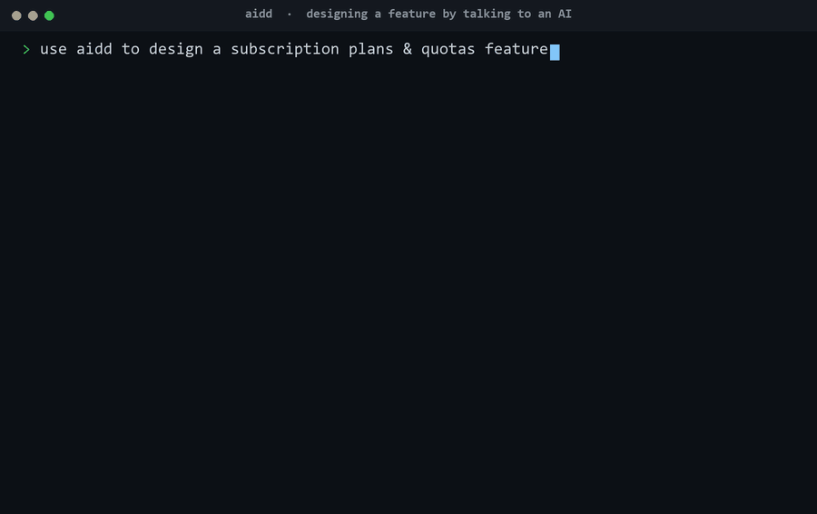
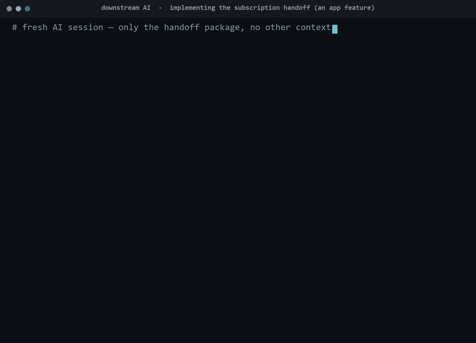
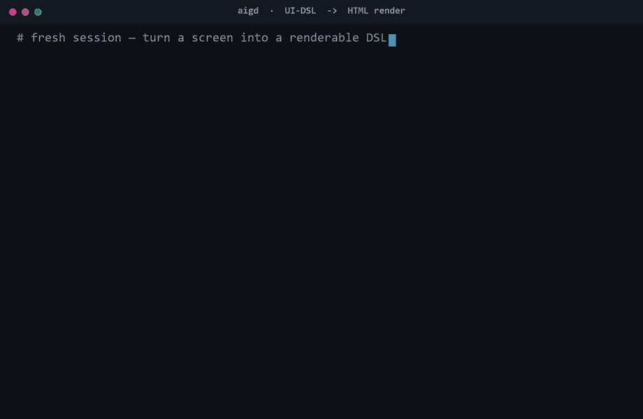
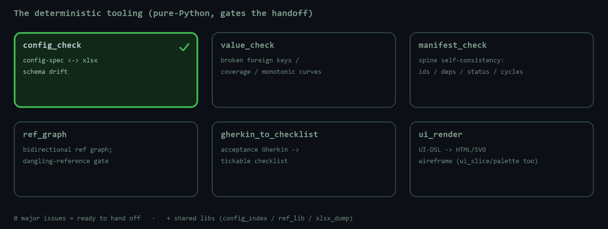
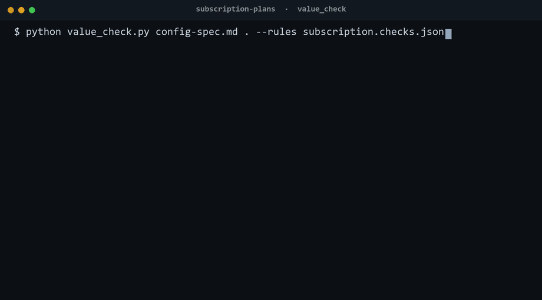

# AIDD — AI-assisted Design→Dev (portable skill)

[](https://github.com/ProdaZhang/aidd/actions/workflows/tests.yml)

*Brainstorm a system's design with one AI; hand the result to another AI to build it — backed by deterministic checkers that won't let a broken handoff through. Game systems or app/SaaS features, same engine.*

> 🧬 Game-focused sibling: **[ProdaZhang/aigd](https://github.com/ProdaZhang/aigd)** (AIDD is the domain-neutral evolution, with an app example).

**Who it's for — and what each role gets:**

- **Product / design / solo devs** — brainstorm the feature with an AI (feed it a design doc if you have one, else it interviews you) → a **clickable prototype** to try → iterate → a **finalized package another AI can build from**.
- **Engineers** — a **typed interface contract** (client = server) + config spec + acceptance cases → another AI (or you) implements it without ambiguity.
- **QA** — **acceptance cases + a visual Excel checklist** → another AI runs the tests, or do black-box testing straight from the Excel.



**You only do two things: brainstorm the design with an AI, and set the numbers.** The flow turns the discussion into structured output (rules carry IDs · numbers live in config · UI-DSL · interface contract · acceptance cases), gates consistency with **deterministic checkers**, and packages a **platform-agnostic handoff** that **another AI can implement directly** — verified by a real run in this repo (below).

---

## What it solves

System-design handoff breaks when **docs and config quietly drift out of sync** — downstream each reads its own version, implementations fork. AIDD blocks this: structured output (rules tagged with R-codes / numbers living in config / prose only referencing `table[key].field`), explicit ledgering of the undecided (`[to confirm]` handed to a person), and deterministic machine checks (`config_check` / `value_check` / `manifest_check` / `ref_graph`, **0 major = handoffable**). It's discussion-driven, doesn't decide your numbers for you, and doesn't bind to an engine.

**It is domain-neutral.** Config/rule/UI-heavy surfaces are the sweet spot — game systems (inventory, crafting, progression) *and* app/SaaS features (plans & quotas, permissions, feature flags, forms, onboarding). The checker built for a game level-ladder is the same one that catches "a higher pricing tier accidentally gives a smaller quota."

## Another AI builds it — and the acceptance tests pass



<sub>↑ a **real run** — a from-scratch implementation built only from the example's handoff package (a non-game SaaS feature) passes all 5 acceptance scenarios (`5 passed, 0 failed`).</sub>

## What it produces — the handoff package (6-piece set)


rules (R-codes, no bare numbers) · config tables (xlsx) + field spec · UI prototype (rendered from a UI-DSL) · interface contract (`.proto`, client = server) · acceptance (Gherkin, references config truth) · spine (manifest: systems + deps + status). Platform-agnostic — another AI (or person) develops straight from it.

## UI: a DSL renders to a clickable prototype



## The deterministic checkers that gate it





<sub>↑ a **real run** of `value_check` — it flags a non-monotonic quota ladder (`planTier.seats` drops at tier 3), the classic "a higher tier accidentally gives less" bug.</sub>

## Install (one folder)

Copy the single `aidd/` folder into the host's skills directory:

| harness | install to |
|---------|------|
| Claude Code | `.claude/skills/` |
| ZCode (Claude family) | `~/.zcode/skills/` |
| Gemini CLI | `~/.gemini/skills/` (or `gemini skills install <repo>`) |
| Codex | `~/.codex/skills/aidd` (or its built-in skill-installer) |

One skill: `aidd` reads the project spine, judges progress, and routes you to the right phase playbook in `references/`. Running the checkers needs Python (mostly pure standard library; some need `openpyxl`/`Pillow`, see `aidd/references/scripts/requirements.txt`).

## Try it (runnable, ~2 minutes)

A complete handoff package for a **non-game** feature — SaaS subscription plans + quotas — with all checkers green and a from-scratch reference implementation that passes its acceptance tests:

```bash
cd aidd/references/examples/subscription-plans
S=../../scripts
python $S/config_check.py config-spec.md subscription.xlsx          # OK no drift
python $S/value_check.py config-spec.md . --acc acceptance.md --rules subscription.checks.json   # OK
python $S/manifest_check.py manifest.md                             # 0 major
python $S/ref_graph.py . --check                                    # no dangling refs
cd _reference-impl && python test_entitlements.py                  # 5 passed, 0 failed
```

## The flow

concept (once, build the spine) → per system { **design** → **iterate** after a dry-run → **finalize & hand off** } → **sync** the spine (continuous). One skill routes you to each phase's playbook; ordering isn't enforced.

## Scope (what it is not)

- **Manages structure & consistency, not quality**: the checkers catch broken links / coverage / monotonicity / schema drift; they don't judge whether the design is good (balance, UX, business correctness).
- **The HTML prototype validates information architecture & flow**, not feel / timing / networking.
- **Doesn't decide your numbers / conventions** — undecided → `[to confirm]`, handed to a person.
- Goes as far as a **handoff package**; tech-stack choice & implementation = downstream.

## License

[MIT](LICENSE) © 2026 ProdaZhang.

## Status

v0 (pre-release). Engine (the deterministic checkers) is shared with `aigd` and battle-tested there; the app side is seeded by the subscription example (full chain green). `references/patterns/` will grow an app-pattern library (quota ladders, RBAC matrices, feature flags, form validation). Checker tests: `aidd/references/scripts/tests/`.
